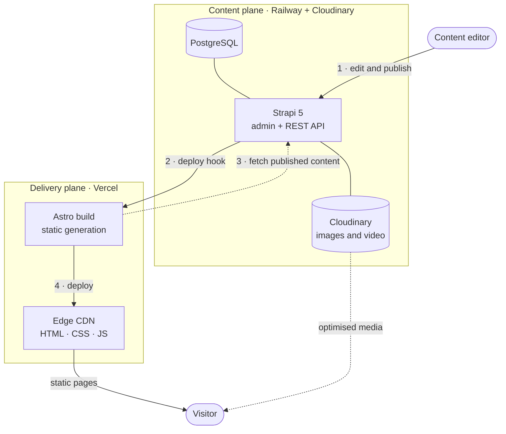
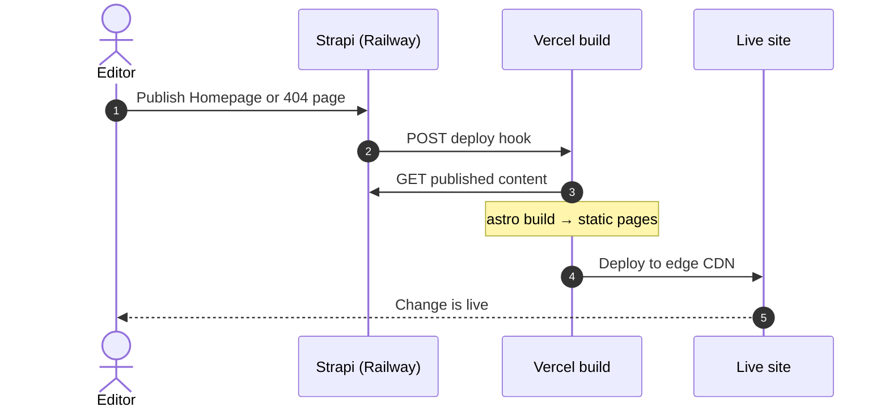

<div align="center">

# nōta

**A cinematic, CMS-driven product site for the nōta smart pen.**

Static-first Astro frontend · Strapi headless CMS · scroll-driven GSAP storytelling

[Live site](https://nota-revamp.vercel.app) · [Architecture](#architecture) · [Getting started](#getting-started) · [Deployment](#deployment)

<br/>


</div>

---

## Overview

nōta is a single-page product experience built for speed and editability:

- **Fast by default** — pages are pre-rendered to static HTML and served from Vercel's edge CDN. No server runs per request.
- **Fully editable** — every headline, paragraph, image and video comes from Strapi. Editors publish; the site rebuilds itself.
- **Motion-led storytelling** — pinned, scroll-driven scenes (GSAP + Lenis) walk the visitor through the product.

## Tech stack

| Layer    | Technology                                                                                                                                                                                | Role                                                              |
| -------- | ----------------------------------------------------------------------------------------------------------------------------------------------------------------------------------------- | ----------------------------------------------------------------- |
| Frontend |              | Static site generation, typed components and content              |
| Styling  |                                                                                       | CSS-first design tokens (`@theme`), utility classes               |
| Motion   |                                           | ScrollTrigger scenes, MotionPath handwriting, smooth scrolling    |
| CMS      |                                                                                                        | Headless content model, admin panel, public read-only REST API    |
| Database |  -003B57?logo=sqlite&logoColor=white>) | Postgres in production, SQLite for local development              |
| Media    |                                                                                              | Image and video storage with optimised delivery (`f_auto,q_auto`) |
| Hosting  |                      | Vercel serves the site; Railway runs Strapi and Postgres          |

## Architecture

The system is split into a **content plane** (Strapi on Railway, media on Cloudinary) and a **delivery plane** (static pages on Vercel). Content is only read at build time, so visitors never touch the CMS.



**How a page is built**

1. `src/lib/strapi.ts` fetches the published **Homepage** and **404 page** single types from Strapi's public, read-only API.
2. The raw responses are mapped into typed shapes (`HomepageContent`, `NotFoundContent`) defined in `src/content/`.
3. `src/pages/index.astro` passes each section its slice of content as props; components never fetch data themselves.
4. Astro renders everything to static files. Client-side JavaScript is limited to the animations, the mobile menu and video playback.

## Publishing workflow

Publishing or unpublishing in Strapi fires a document-service middleware (`cms/src/index.ts`) that calls the Vercel deploy hook. Vercel rebuilds the site with the new content and swaps it in atomically.



> [!IMPORTANT]
> **Changes go live in about 5–6 seconds.**
> Because the site is statically generated, every publish triggers a fresh build. After publishing in Strapi, wait around **5–6 seconds**, then refresh the live site to see the update.

## Motion system

| Scene                 | What happens                                                                                       | Built with                       |
| --------------------- | -------------------------------------------------------------------------------------------------- | -------------------------------- |
| Global                | Momentum smooth scrolling, synced to every scroll-driven scene                                     | Lenis + ScrollTrigger            |
| Hero                  | The pen enters lying flat, turns upright as you scroll, then curtains hand off to the next section | Pinned, scrubbed timeline        |
| Specifications        | A pen writes "nōta" in cursive; scroll is held until the writing finishes, once per visit          | MotionPath along SVG strokes     |
| Sync & Inside the box | Product renders crossfade frame by frame while captions change                                     | Pinned, scrubbed frame sequences |
| Order                 | The product shot opens like a lens iris behind a floating checkout panel                           | `clip-path` reveal               |

Background videos start buffering about one screen before they come into view and pause when off-screen (`src/lib/video.ts`).

## Project structure

```text
.
├── src/
│   ├── pages/           # index.astro (homepage) and 404.astro
│   ├── layouts/         # Layout.astro: <head>, SEO meta, fonts, favicons
│   ├── components/      # One component per section, plus PenCutout and PenFrame
│   ├── content/         # Typed content shapes and getHomepageContent() / getNotFoundContent()
│   ├── lib/             # strapi.ts (fetch + mapping), motion.ts (GSAP/Lenis), video.ts
│   └── styles/          # global.css: Tailwind v4 theme and design tokens
├── public/              # Favicons and web manifest
├── cms/                 # Strapi project
│   ├── src/api/         # Homepage and 404 page single types
│   ├── src/components/  # Reusable section and item components
│   ├── src/index.ts     # Publish → Vercel rebuild hook
│   ├── src/seed.ts      # Seeds content and media into an empty database
│   └── config/          # Database, server, and production (Cloudinary) config
└── .env.production      # Public STRAPI_URL used by production builds
```

## Getting started

**Prerequisites:** Node.js 20 or later, and npm.

**1. Start the CMS**

```bash
cd cms
cp .env.example .env   # replace the placeholder secrets
npm install
npm run develop
```

The admin panel opens at `http://localhost:1337/admin`. On an empty database, Strapi seeds itself on first start: it uploads the bundled media and publishes the homepage.

**2. Start the site** (from the repository root, in a second terminal)

```bash
npm install
npm run dev
```

Open `http://localhost:4321`. In development, refreshing the page shows the latest published content.

### Scripts

| Command                           | Description                                                    |
| --------------------------------- | -------------------------------------------------------------- |
| `npm run dev`                     | Start the Astro dev server                                     |
| `npm run build`                   | Type-check and build for production (Strapi must be reachable) |
| `npm run preview`                 | Preview the production build locally                           |
| `npm run lint` / `npm run format` | ESLint and Prettier                                            |

## Deployment

| Service  | Platform                   | Notes                                                                      |
| -------- | -------------------------- | -------------------------------------------------------------------------- |
| Website  | Vercel                     | Builds from the repository root; reads `STRAPI_URL` from `.env.production` |
| CMS      | Railway (root `/cms`)      | Redeploys only when `cms/` changes; sleeps when idle                       |
| Database | Railway PostgreSQL         | Linked via `DATABASE_URL=${{Postgres.DATABASE_URL}}`                       |
| Media    | Cloudinary (folder `nota`) | Upload provider enabled in production only                                 |

### Environment variables

**Website**

| Variable     | Description                                                                    |
| ------------ | ------------------------------------------------------------------------------ |
| `STRAPI_URL` | Base URL of the Strapi API. Defaults to `http://localhost:1337` in development |

**CMS (Railway)**

| Variable                                                                                                | Description                                           |
| ------------------------------------------------------------------------------------------------------- | ----------------------------------------------------- |
| `DATABASE_CLIENT`, `DATABASE_URL`                                                                       | `postgres` and the Railway Postgres connection string |
| `PUBLIC_URL`                                                                                            | Public URL of the Strapi service                      |
| `CLOUDINARY_NAME`, `CLOUDINARY_KEY`, `CLOUDINARY_SECRET`                                                | Cloudinary credentials for media uploads              |
| `VERCEL_DEPLOY_HOOK_URL`                                                                                | Deploy hook called on publish to rebuild the site     |
| `APP_KEYS`, `API_TOKEN_SALT`, `ADMIN_JWT_SECRET`, `JWT_SECRET`, `TRANSFER_TOKEN_SALT`, `ENCRYPTION_KEY` | Strapi security secrets                               |

## Why Astro (and Strapi)

- **Content-first, not app-first.** nōta is a marketing page with rich motion but very little application state. Astro renders it to static HTML and ships zero framework JavaScript by default. Only the small scripts each section needs are sent to the browser.
- **Static output, edge-fast.** Pre-rendered pages load straight from Vercel's CDN, with no server to scale, patch or pay for per request.
- **Build-time data fits a headless CMS.** Content is fetched once, in typed component frontmatter, so visitors never wait on the CMS.
- **Strapi** was chosen as an open-source, self-hostable CMS whose component-based modelling mirrors the page's sections one-to-one, with an admin panel non-technical editors can use on day one.

## Key trade-offs

| Decision                                                | Benefit                                                        | Cost                                                                                                                 |
| ------------------------------------------------------- | -------------------------------------------------------------- | -------------------------------------------------------------------------------------------------------------------- |
| Static generation instead of server rendering           | Fastest possible load, no runtime server, minimal hosting cost | Content changes need a rebuild (about 5–6 seconds) and drafts can't be previewed on the live site                    |
| Holding scroll during the handwriting scene             | Every visitor sees the key brand moment                        | Briefly takes control from the user; mitigated by once per visit, nav links bypassing it, and reduced-motion opt-out |
| Plain GSAP in Astro components instead of React islands | Far less JavaScript shipped                                    | Imperative DOM code instead of declarative components                                                                |     |

## What I'd improve with more time

- **Draft previews** — a server-rendered preview route using Strapi's draft API, so editors can review changes before publishing.
- **Smarter rebuilds** — debounce the deploy hook so several quick publishes trigger a single build.
- **Accessibility polish** — focus trapping in the mobile menu, and showing one caption at a time in the sync scene for reduced-motion visitors.
- **True product assets** — transparent or 3D pen renders to replace the traced cutout.
- **Resilience and reach** — build against cached content if Strapi is unreachable, localisation with Strapi i18n, and privacy-friendly analytics.

## AI tools used

| Tool                        | How it was used                                                                                                                                                               |
| --------------------------- | ----------------------------------------------------------------------------------------------------------------------------------------------------------------------------- |
| **Claude Code** (Anthropic) | Used Claude AI coding agent as a development pair programmer to assist with the Astro migration, Strapi setup, deployment pipeline, animations, debugging, and documentation. |

Every AI-assisted change was reviewed, tested in the browser, and approved by me before being committed.
